# 2022春-编译实验

## 实验一

### 实验目的

* 熟悉Linux系统环境。

* 熟悉Cool语言的源程序语法特点。

* 了解实验系统组成及安装，掌握Cool语言，了解Cool程序编译和执行的工作过程。

### 实验内容

#### 安装`flex`, `bison`


```java
class Main inherits IO
{
   main():SELF_TYPE
   {
      {
         out_string("Hello,World!\n");
      }
   };
};
```

#### 编写`makefile`

编译`hello_world.cl`

```makefile
#######################################
# 编辑这里
# 把CLASSDIR设置成cool文件的位置
# 以便让Makefile通过 ${CLASSDIR}/bin 可以找到coolc
# 下面是我的电脑上cool文件夹的位置
CLASSDIR=/home/radiance/compiler_exp
#######################################

CLASS= cs-compiler
SRC= hello_world
LSRC= Makefile

CC=gcc
CFLAGS=-g

default: compile 

compile:
	${CLASSDIR}/bin/coolc ${SRC}.cl 
	${CLASSDIR}/bin/spim -trap_file ${CLASSDIR}/lib/trap.handler -file ${SRC}.s


clean :
	rm -f *.s core *~
```

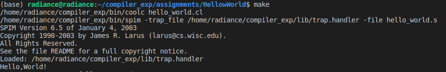

## 实验二

### 实验目的

1. 熟悉Cool语言的源程序语法特点。

2. 完成第一个PA作业

3. 编写COOL代码，编写makefile程序

### 实验内容

* 完成作业PA1——完成stack.cl
* 阅读PA1里面的readme
* 写stack.cl,满足堆栈机


| 命令 | 含义                                             |
| ---- | ------------------------------------------------ |
| Int  | 将整数 int 压入栈顶                              |
| +    | 将字符 ‘+’ 压入栈顶                              |
| s    | 将字符 ‘s’ 压入栈顶                              |
| e    | 计算栈顶的表达式的值                             |
| d    | 在屏幕上展示栈的内容，从栈顶开始，每个元素占一行 |
| x    | 退出堆栈机程序                                   |

### 实验步骤

#### 编写`stack.cl`堆栈机

主函数main()主体为一个while true“死循环”，对prompt()返回的输入字符串s进行处理，对数字、加减运算符及交换操作符输入，默认操作为入栈.

```java
	main():Object
	{
		( let z : A2I <- new A2I  , stack : List <- new List in
			while true loop
			( let s : String <- prompt() in
				if s = "x" then
					abort()
				else
					if s = "d"  then
						display_stack(stack)
					else
					    if s = "e"  then
							{
								if stack.isNil() then out_string("")
								
								else
								if stack.head() = "+" then
									{
										stack <- stack.tail();
										(let a : Int <- new Int, b : Int <- new Int in 	
											{
												--out_string(stack.head());
												a  <- z.a2i(stack.head());
												stack <- stack.tail();
												b  <- z.a2i(stack.head());
												stack <- stack.tail();
												a <- a + b;
												--out_string(z.i2a(a));
												stack <- stack.cons(z.i2a(a));
											}
										);
									}
								else
									if stack.head() = "s" then
										{
											stack <- stack.tail();
											(let a : String <- new String , b : String <- new String in 
												{
													a  <- stack.head();
													stack <- stack.tail();
													b  <- stack.head();
													stack <- stack.tail();
													stack <- stack.cons(a);
													stack <- stack.cons(b);
												}
											);
										}
									else
										out_string("")
									fi
									fi
								fi;
							}
						else
							stack <- stack.cons(s)
						fi
					fi
				fi
			)
			pool
		)
	};
```

#### 编写`utils.cl`

```java
class A2I {

     c2i(char : String) : Int {
	if char = "0" then 0 else
	if char = "1" then 1 else
	if char = "2" then 2 else
        if char = "3" then 3 else
        if char = "4" then 4 else
        if char = "5" then 5 else
        if char = "6" then 6 else
        if char = "7" then 7 else
        if char = "8" then 8 else
        if char = "9" then 9 else
        { abort(); 0; }  -- the 0 is needed to satisfy the typchecker
        fi fi fi fi fi fi fi fi fi fi
     };

(*
   i2c is the inverse of c2i.
*)
     i2c(i : Int) : String {
	if i = 0 then "0" else
	if i = 1 then "1" else
	if i = 2 then "2" else
	if i = 3 then "3" else
	if i = 4 then "4" else
	if i = 5 then "5" else
	if i = 6 then "6" else
	if i = 7 then "7" else
	if i = 8 then "8" else
	if i = 9 then "9" else
	{ abort(); ""; }  -- the "" is needed to satisfy the typchecker
        fi fi fi fi fi fi fi fi fi fi
     };

(*
   a2i converts an ASCII string into an integer.  The empty string
is converted to 0.  Signed and unsigned strings are handled.  The
method aborts if the string does not represent an integer.  Very
long strings of digits produce strange answers because of arithmetic 
overflow.

*)
     a2i(s : String) : Int {
        if s.length() = 0 then 0 else
	if s.substr(0,1) = "-" then ~a2i_aux(s.substr(1,s.length()-1)) else
        if s.substr(0,1) = "+" then a2i_aux(s.substr(1,s.length()-1)) else
           a2i_aux(s)
        fi fi fi
     };

(*
  a2i_aux converts the usigned portion of the string.  As a programming
example, this method is written iteratively.
*)
     a2i_aux(s : String) : Int {
	(let int : Int <- 0 in	
           {	
               (let j : Int <- s.length() in
	          (let i : Int <- 0 in
		    while i < j loop
			{
			    int <- int * 10 + c2i(s.substr(i,1));
			    i <- i + 1;
			}
		    pool
		  )
	       );
              int;
	    }
        )
     };

(*
    i2a converts an integer to a string.  Positive and negative 
numbers are handled correctly.  
*)
    i2a(i : Int) : String {
	if i = 0 then "0" else 
        if 0 < i then i2a_aux(i) else
          "-".concat(i2a_aux(i * ~1)) 
        fi fi
    };
	
(*
    i2a_aux is an example using recursion.
*)		
    i2a_aux(i : Int) : String {
        if i = 0 then "" else 
	    (let next : Int <- i / 10 in
		i2a_aux(next).concat(i2c(i - next * 10))
	    )
        fi
    };

};
```

#### 编写`makefile`

修改`makefile`,将`stack.cl`和`utils.cl`联合编译


```makefile
#######################################
# 编辑这里
# 把CLASSDIR设置成cool文件的位置
# 以便让Makefile通过 ${CLASSDIR}/bin 可以找到coolc
# 下面是我的电脑上cool文件夹的位置
CLASSDIR=/home/radiance/compiler_exp
#######################################

ASSN = 1
CLASS= cs-compiler
SRC= stack.cl utils.cl README.SKEL 
LSRC= Makefile

CC=gcc
CFLAGS=-g

default: source compile test

.c.o:
	${CC} ${CFLAGS} -c $<

source : lsource
	${CLASSDIR}/etc/copy-skel ${ASSN} ${SRC}

lsource:
	${CLASSDIR}/etc/link-shared ${ASSN} ${LSRC}

compile: demo

demo: demo.cl
	@echo create demo.s
	${CLASSDIR}/bin/coolc demo.cl 

test:	compile
	@echo test demo.s
	${CLASSDIR}/bin/spim -trap_file ${CLASSDIR}/lib/trap.handler -file demo.s

run:	compile
	@echo run demo.s
	${CLASSDIR}/bin/spim -trap_file ${CLASSDIR}/lib/trap.handler -file demo.s

clean :
	rm -f *.s core *~

main: 
	@echo compile and run $(file).cl
	${CLASSDIR}/bin/coolc $(file).cl
	${CLASSDIR}/bin/spim -trap_file ${CLASSDIR}/lib/trap.handler -file $(file).s

# lex
lex:
	@echo run flex $(file).l
	flex $(file).l
	cc -o $(file).out lex.yy.c -lfl
	rm lex.yy.c
```

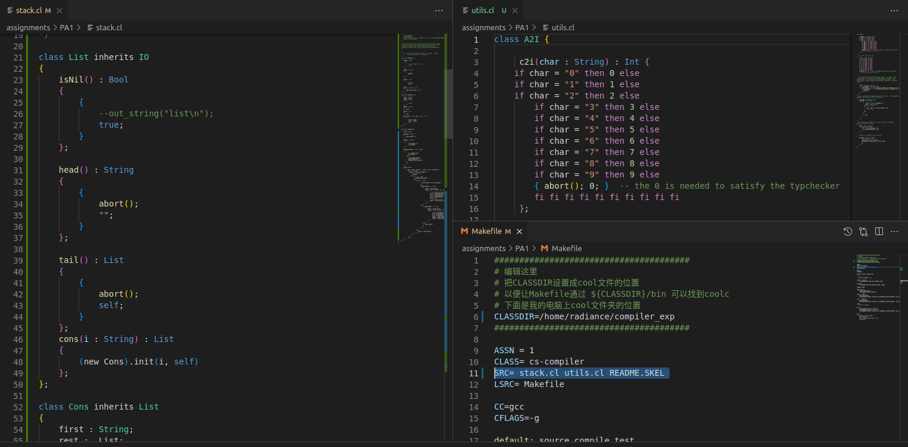

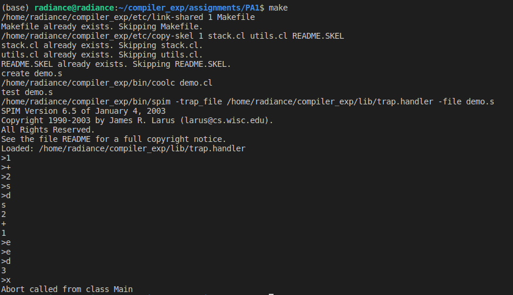

## 实验三

### 实验目的

掌握词法单元的正规式描述，词法分析器的原理及工作过程。

### 实验内容

* 实现打印输入文字的行数，列数和字数。

* 实现统计给定程序文件的行数，列数和字数

* 实现多重入口

### 实验步骤

#### 统计输入文字的行数，列数和字数

编写`.l`文件, 统计输入文字的行数，列数和字数,用`nline,ncolumn,nnword,column`存取

```java
%{
/*
 * 统计行数，列数和字数
 */
#include <stdio.h>
int nline,ncolumn,nnword,column; /* 分别记录行数，列数和字数 */
%}

%%

[ \t] {column++;}
[^ \t\n]+ {
    nnword++;
    column+=yyleng;
}
\n {
    ncolumn=(ncolumn>column)?ncolumn:column;
    ++nline;
    column=0;
}

%%

int main(){
    printf("Press CTRL+d to quit.\nInput any text:\n");
    yylex();             /* 调用词法分析器，直到输入结束  */
    printf("nline=%d, ncolumn=%d, nnword=%d\n", nline, ncolumn, nnword);
    return 0;
}
```


#### 统计统计给定程序文件的行数，列数和字数

更改`main`函数,使用`yyin=fp_input`作输入

```java
int main(int argc, char **argv){
    if(argc > 1) {
        if(!(yyin=fopen(argv[1],"r"))) {
            perror(argv[1]);
            return 1;
        }
    }
    yylex();             /* 调用词法分析器，直到输入结束  */
    printf("nline=%d, ncolumn=%d, nnword=%d\n", nline, ncolumn, nnword);
    return 0;
}
```

```makefile
default:
	flex ${CLASSDIR}/assignments/PA2.1/${FILENAME}
	gcc -o lex.yy ${CLASSDIR}/assignments/PA2.1/lex.yy.c  -ll
	${CLASSDIR}/assignments/PA2.1/lex.yy text
```


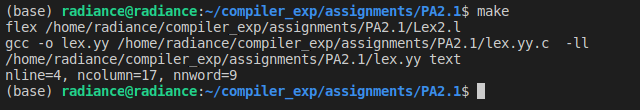

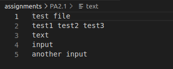

#### 实现多重入口

1. 若行首以字母a开始，则将紧跟其后的序列 magic 变化为first 输出;
2. 若行首以字母b开始，则将紧跟其后的序列 magic 变化为second 输出;
3. 若行首以字母c开始，则将紧跟其后的序列 magic 变换为third 输出；
4. 其他地方出现的 magic 统一变化为 zero;
5. 其他行和非magic的字符序列 原样输出。

```java
%{
/* 功能：
 * 将输入复制到输出，同时对输入文本中的字符序列“magic”做变换：
 *  (1) 若行首以字母a开始，则将紧跟其后的第1个序列"magic"变化为"first"输出;
 *  (2) 若行首以字母b开始，则将紧跟其后的第1个序列"magic"变化为"second"输出;
 *  (3) 若行首以字母c开始，则将紧跟其后的第1个序列"magic"变化为"third"输出;
 *  (4) 其他地方出现的序列"magic"变化为"zero"输出;
 *  (5) 其他行和非magic单词不变，直接输出。
 */

#include <stdio.h>
%}
%start AA BB CC
%%
^a  		{ ECHO; BEGIN AA; }
^b			{ ECHO; BEGIN BB; }
^c			{ ECHO; BEGIN CC; }

<AA>magic		{ printf ("first"); }
<BB>magic		{ printf ("second");}
<CC>magic		{ printf ("third");}
\n|(\t)+|" "+	{ ECHO; BEGIN 0; }
magic		{ printf ("zero");}

%%

int main()
{
   int a;
   a = yylex();
   return 0;
}

int yywrap() { return 1; }
```

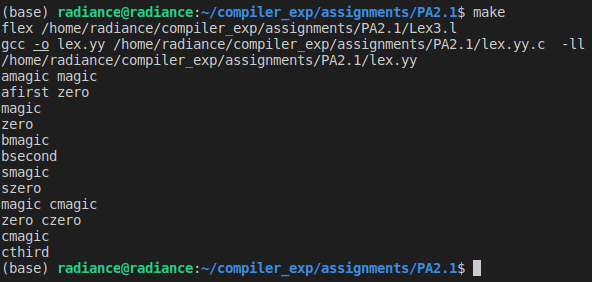

## 实验四

### 实验目的

* 熟悉Cool语言的源程序语法特点。

* 完成第二个PA作业

* 编写COOL代码，编写makefile程序

### 实验内容

* 完成PA2作业，写COOL语言词法分析器，用flex工具，使用flex输入模式描述cool的token。

### 实验步骤

#### 编写`COOL`的词法分析程序

```java
/*
 *  这个文件用来生成一个COOL语言的词法分析程序.
 */

/*
 *  lex文件的第一个部分，也就是包含在“%{”和“ %}”之间的部分，是用来像未来的词法分析程序输出代  
 *  码的，也就是说这里的需要include头文件，extern外部变量，因为这部分是要直接照搬到以后的.c文 
 *  件中去的 
 */
%{
#include <cool-parse.h>  //记号的定义放在cool-parse.h文件中
#include <stringtab.h>
#include <utilities.h>

/* 词法分析程序需要的宏定义 */
#define yylval cool_yylval
#define yylex  cool_yylex

/* 字符串常量的最大长度 */
#define MAX_STR_CONST 1025
#define YY_NO_UNPUT   /* 让g++的编译结果变得友好 */

extern FILE *fin; /* 从这个文件指针读取记号 */

/* 定义YY_INPUT以后我们就可以从fin中读取记号了:
 */
#undef YY_INPUT
#define YY_INPUT(buf,result,max_size) \
	if ( (result = fread( (char*)buf, sizeof(char), max_size, fin)) < 0) \
		YY_FATAL_ERROR( "read() in flex scanner failed");

char string_buf[MAX_STR_CONST]; /* 记录字符串的字符数组*/
char *string_buf_ptr;

extern int curr_lineno;
extern int verbose_flag;

extern YYSTYPE cool_yylval;

/*
 *  在这里添加你自己的头文件和变量
 */

int uniqueIndex =1;

%}

/*
 * 第二部分用来定义正则表达式需要的“元素”
 */

/* 下面是我们给出的基本实例 */
TYPEID          [A-Z]+[_A-Za-z0-9]*
OBJECTID        [a-z]+[_a-zA-Z0-9]*

STR_CONST       \".*\"
INT_CONST       [0-9]+

WHITE           [ \t]+
LINE            \n

%s              MutiCom

%%

"--"[^\n]*        {/* 忽略掉一行的注释 */}
"(*"              {BEGIN(MutiCom);}

<MutiCom>[^\n*]*   {}
<MutiCom>"*"+[^*)\n]* {}
<MutiCom>\n       {++curr_lineno;}
<MutiCom>"*"+")"  {BEGIN(INITIAL);}


"class"           {return CLASS;}
"inherits"        {return INHERITS;}

"if"              {return IF;}
"else"            {return ELSE;}
"then"            {return THEN;}
"fi"              {return FI;}

"let"             {return LET;}
"in"              {return IN;}

"while"           {return WHILE;}
"loop"            {return LOOP;}
"pool"            {return POOL;}

"case"            {return CASE;}
"esac"            {return ESAC;}
"of"              {return OF;}

"new"             {return NEW;}

"isvoid"          {return ISVOID;}

"true"            {
                     cool_yylval.boolean = 1;
                     return BOOL_CONST;
                  }
"false"           {
                     cool_yylval.boolean=0;
                     return BOOL_CONST;
                  }
"not"             {return NOT;}

"SELF_TYPE"       {
                     cool_yylval.symbol=new IdEntry(yytext,strlen(yytext),uniqueIndex++);
                     return TYPEID;
                  }
  
"self"            { 
                     cool_yylval.symbol=new IdEntry(yytext,strlen(yytext),uniqueIndex++);
                     return OBJECTID;               
                  }

"le"              {return LE;}

"<-"              {return ASSIGN;} 
"=>"              {return DARROW;}

"{"               {return '{';}
"}"               {return '}';}
"("               {return '(';}
")"               {return ')';}
":"               {return ':';}
";"               {return ';';}
"+"               {return '+';}
"-"               {return '-';}
"*"               {return '*';}
"/"               {return '/';}
"="               {return '=';}
"<"               {return '<';}
"."               {return '.';}
"~"               {return '~';}
","               {return ',';}
"@"               {return '@';}


{TYPEID}          {  
                    cool_yylval.symbol = new IdEntry(yytext,strlen(yytext),uniqueIndex++);
                    return TYPEID;
                  }

{OBJECTID}        {
                    cool_yylval.symbol = new IdEntry(yytext,strlen(yytext),uniqueIndex++);
                    return OBJECTID;
                  } 


{STR_CONST}       {
                    cool_yylval.symbol = new StringEntry(yytext,strlen(yytext),uniqueIndex++);
                    return STR_CONST;
                  }

{INT_CONST}       {
                    cool_yylval.symbol = new IntEntry(yytext,strlen(yytext),uniqueIndex++);
                    return INT_CONST;
                  }

{WHITE}           {}

{LINE}            {curr_lineno++;}

.                {
                    cool_yylval.error_msg = new char[strlen(yytext+1)];
                    strcpy(cool_yylval.error_msg,yytext);
                    return ERROR;
                  }

%%

int yywrap()
{
   return 1;
}
```

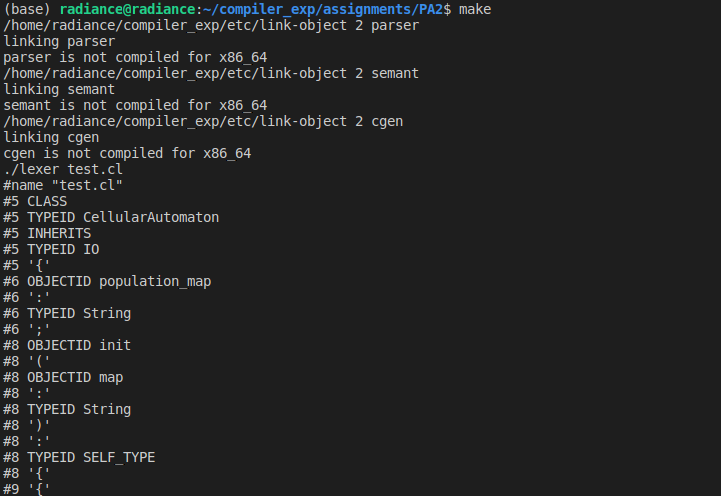

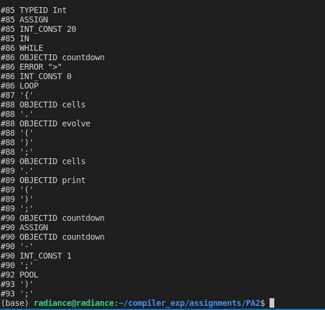

## 实验五

### 实验目的

* 理解语法分析的过程与原理、规则定义与实现

* 熟悉YACC的用法及原理

### 实验内容

* 编写一个简单的.y文件，能实现一个简单的一位数十进制计算器，包括减法、乘法运算。
* 在任务1的基础上增加除法和加法，并能识别负数。
* 在任务2的基础上使用.l文件完成词法分析识别数字，并实现浮点数处理功能。

### 实验原理

YACC 是一个语法分析器的生成器，接受用 BNF 形式的 LALR(1) 文法（ LL(1)、SLR(1)的真超集）. LEX识别记号，提供了一组词法变量（描述记号的属性和值）YACC识别语言的语法结构，提供了一组语义变量（即语义栈中的元素，表示文法符号的属性值）, 支持语法制导翻译.

Flex的主要用途之一就是与yacc分析生成器一起使用。yacc分析器将会调用名字为‘yylex()’的函数来获得下一个输入标识。该函数应该返回下一个输入标识的类型，并且将关联的值放在全局变量yyval中。若要使用与yacc一起使用flex，需要给yacc使用‘-d’选项，用来指示生成包含出现在yacc输入中的所有‘%tokans’的定义的文件‘y.tab.h’。然后将该文件包含在flex扫描器中。

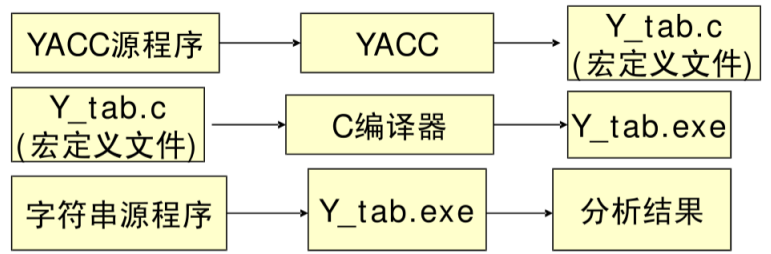

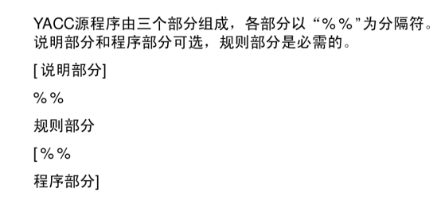

### 实验步骤

#### 十进制计数器

**编写cal.l**

```java
%{
/*
 * 识别整数 加减乘除 括号
 */
#include "task1.tab.h"
%}

%%

[0-9]+          { yylval = atoi(yytext); return T_NUM; }
[-/+*()\n]      { return yytext[0]; }
.               { return 0; /* end when meet everything else */ }

%%

int yywrap(){
    return 1;
}
```

**编写cal.y**

运算符结合性,判断优先级

```java
%{
#include <stdio.h>
void yyerror(const char* str){};
%}

%token T_NUM

%left '+' '-'
%left '*' '/'
%right uminus
```

代数运算的规约规则

```java
%%
S   :   S E '\n'        { printf("ans = %d\n", $2); }
    |   /* empty */     { /* empty */ }
    ;

E   :   E '+' E         { $$ = $1 + $3; }
    |   E '-' E         { $$ = $1 - $3; }
    |   E '*' E         { $$ = $1 * $3; }
    |   E '/' E         { $$ = $1 / $3; }
    |   '-' E %prec uminus { $$ = -$2; }
    |   T_NUM           { $$ = $1; }
    |   '(' E ')'       { $$ = $2; }
    ;

%%
int main() {
    return yyparse();
}
```

联合编译`makefile`


```makefile
default: multi

multi:
	flex -o ${file}.yy.c ${file}.l
	bison -d ${file}.y
	bison -o ${file}.tab.c ${file}.y
	gcc -o ${file}.out ${file}.yy.c ${file}.tab.c
	./${file}.out

single:
	bison -o ${file}.c ${file}.y
	gcc -o ${file}.out  ${file}.c
	./${file}.out

```

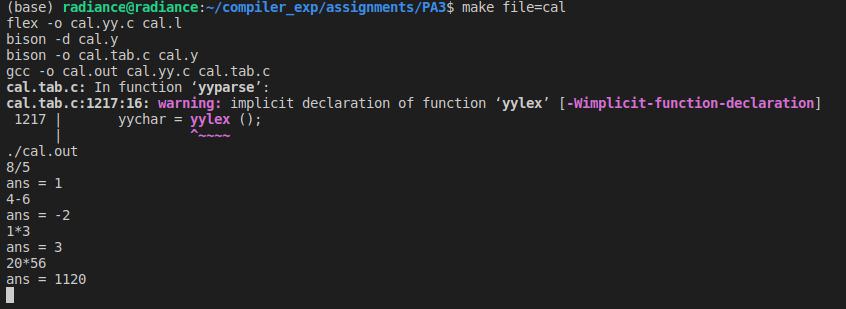

#### 浮点数支持

更改`cal.y`,更改规则

```java
%%
[0-9]+[.][0-9]+  {yylval = atof(yytext); return T_NUM; }
[0-9]+           {yylval = atof(yytext); return T_NUM; }
[-/+*()\n]      { return yytext[0]; }
%%
```

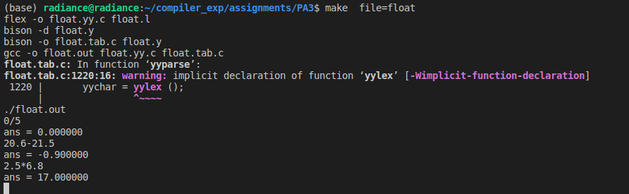

## 实验六

### 实验目的

掌握语法分析的过程及原理，熟悉YACC的原理及工作过程。

### 实验内容

* 读readme，handout等文件，查找自己文件目录
* 编写一个cool.y文件，根据cool语言的标准文法（产生式）完成cool语言语法分析，输出语法分析树结果。
* 修改makefile，自动编译
* 写good.cl和bad.cl测试文法错误

### 实验步骤

#### 编写`cool.y`

```matlab
/* Declare types for the grammar's non-terminals. */
%type <program> program
%type <classes> class_list
%type <class_> class

/* You will want to change the following line. */
  %type <features> feature_list
  %type <feature> feature
	%type <formals> formal_list
	%type <formal> formal
	%type <expressions> expression_list1
	%type <expressions> expression_list2
	%type <expression> expression

/* Precedence declarations go here. */
	%right FLAG
	%right ASSIGN
	%right NOT
	%nonassoc '<' '=' LE
	%left '+' '-'
	%left 
```

```java
%%
    /* Save the root of the abstract syntax tree in a global variable. */
    program		: class_list { 
					@$ = @1; 
					ast_root = program($1); 
				}
				;
    
    class_list	: class	{ /* single class */
					$$ = single_Classes($1);
					parse_results = $$; 
				}
				| class_list class { /* several classes */
					$$ = append_Classes($1, single_Classes($2)); 
					parse_results = $$;
				}
				;
    
    /* If no parent is specified, the class inherits from the Object class. */
    class		: CLASS TYPEID '{' feature_list '}' ';'	{
					$$ = class_($2, idtable.add_string("Object"), $4, stringtable.add_string(curr_filename));
				}
				| CLASS TYPEID INHERITS TYPEID '{' feature_list '}' ';' { 
					$$ = class_($2, $4, $6, stringtable.add_string(curr_filename)); 
				}
				| error ';' { yyerrok; }
				;
    
    /* Feature list may be empty, but no empty features in list. */
    feature_list : { /* empty */ 
					$$ = nil_Features();
				}
				| feature_list feature { /* several features */
					$$ = append_Features($1, single_Features($2));
				}
				;

	feature		: OBJECTID '(' formal_list ')' ':' TYPEID '{' expression '}' ';' {
					$$ = method($1, $3, $6, $8);
				}
				| error ';' {}
				;

	formal_list : {
					$$ = nil_Formals();
				}
				| formal {
					$$ = single_Formals($1);
				}
				| formal_list ',' formal {
					$$ = append_Formals($1, single_Formals($3));
				}
				;
	
	formal		: OBJECTID ':' TYPEID {
					$$ = formal($1, $3);
				}
				;
	
	expression_list1 : { /* empty */
					$$ = nil_Expressions();
				}
				| expression { /* single expression */
					$$ = single_Expressions($1);
				} 
				| expression_list1 ',' expression { /* several expressions */
					$$ = append_Expressions($1, single_Expressions($3));
				}
				;

	expression_list2 : expression ';' { /* single expression */
					$$ = single_Expressions($1);
				} 
				| expression_list2 expression ';' { /* several expressions */
					$$ = append_Expressions($1, single_Expressions($2));
				}
				| error ';' { yyerrok; }
				;

	expression	: OBJECTID ASSIGN expression {
					$$ = assign($1, $3);
				}
				| expression '.' OBJECTID '(' expression_list1 ')' {
					$$ = dispatch($1, $3, $5);
				}
				| IF expression THEN expression ELSE expression FI {
					$$ = cond($2, $4, $6);
				} 
				| WHILE expression LOOP expression POOL {
					$$ = loop($2, $4);
				}
				| '{' expression_list2 '}' {
					$$ = block($2);
				}
				| NEW TYPEID {
					$$ = new_($2);
				}
				| expression '+' expression {
					$$ = plus($1, $3);
				}
				| expression '-' expression {
					$$ = sub($1, $3);
				}
				| expression '*' expression {
					$$ = mul($1, $3);
				}
				| expression '/' expression {
					$$ = divide($1, $3);
				}
				| expression '<' expression {
					$$ = lt($1, $3);
				}
				| expression LE expression {
					$$ = leq($1, $3);
				}
				| expression '=' expression {
					$$ = eq($1, $3);
				}
				| NOT expression {
					$$ = comp($2);
				}
				| '(' expression ')' {
					$$ = $2;
				}
				| OBJECTID {
					$$ = object($1);
				}
				| INT_CONST {
					$$ = int_const($1);
				}
				| STR_CONST {
					$$ = string_const($1);
				}
				| BOOL_CONST {
					$$ = bool_const($1);
				}
				;
    /* end of grammar */
%%
```

#### 编写测试文件

编写`good.cl`

```java
class A {
    str : String;
	li :  List;
};

Class BB__ inherits A {
    newline() : Object
	{
		out_string("\n")
	};
};


class Main inherits IO
{
   main():SELF_TYPE
   {
        while true loop
        ({
            out_string("Hello,World!\n");
        })
        pool
   };
};

```

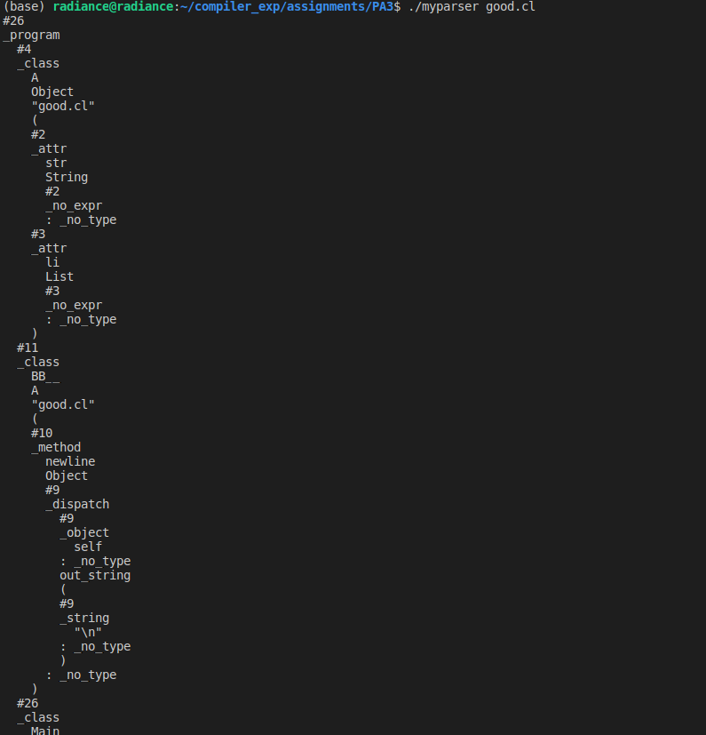

编写`bad.cl`

```java
class A {
};

(* error:  b is not a type identifier *)
Class b inherits A {
};

(* error:  a is not a type identifier *)
Class C inherits a {
};

(* error:  keyword inherits is misspelled *)
Class D inherts A {
};

(* error:  closing brace is missing *)
Class E inherits A {
;

class Main inherits IO {
   main():Int {
   };
};
```


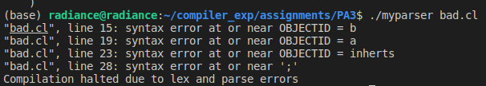

## 实验七

### 实验目的

`Cool`语义分析

### 实验内容

**完成类继承关系的检查**

* 设计有向图数据结构
* 在program_class::check_inheritance_graph函数中将有向图信息填充，并检查类继承关系是否合法（即没有出现循环继承）

### 实验原理

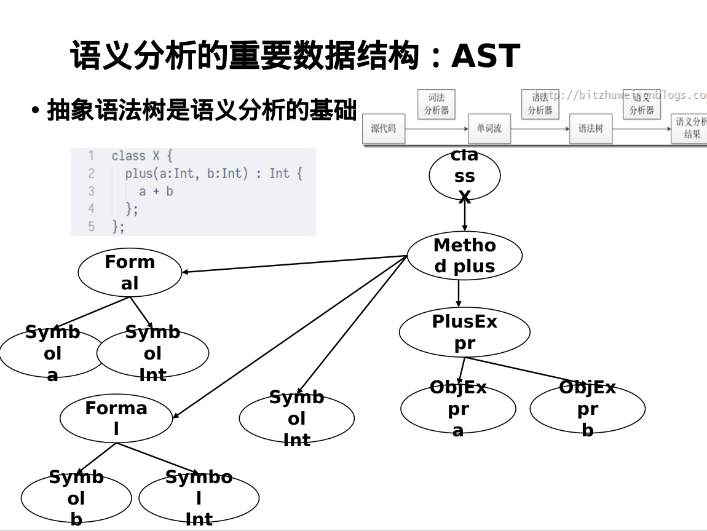

### 实验步骤

#### 编写语义分析程序

在`semant.h`定义`ClassTable`,类型为`std::map<Symbol, Class_>`

```c++
#ifndef SEMANT_H_
#define SEMANT_H_

#include <assert.h>
#include <iostream>  
#include <map>
#include <set>
#include "cool-tree.h"
#include "stringtab.h"
#include "symtab.h"
#include "list.h"

#define TRUE 1
#define FALSE 0

typedef std::map<Symbol, Class_> ClassTable; // name, Class_
ClassTable classTable;

#endif
```

在`semant.cc`加入语法错误处理

```c++

static int semant_errors = 0;
static std::ostream& error_stream = std::cerr;

static std::ostream& semant_error() {
    semant_errors++;
    return error_stream;
}

static std::ostream& semant_error(tree_node *t) {
    error_stream << curr_class->getFileName() << ":" << t->get_line_number() << ": ";
    return semant_error();
}

static std::ostream& internal_error(int lineno) {
    error_stream << "FATAL:" << lineno << ": ";
    return error_stream;
}
```

在`semant.cc`加入检查继承函数`check_inheritance`

```c
static void check_inheritance() {
    for (ClassTable::iterator it = classTable.begin(); it != classTable.end(); it++)
        if (it->first != Object && classTable.find(it->second->getParentName()) == classTable.end()) {
            curr_class = it->second;
            semant_error(curr_class) << "Class " << it->second->getName() << " inherits from an undefined class " << it->second->getParentName() << ".\n";
        }
    
    for (ClassTable::iterator it = classTable.begin(); it != classTable.end(); it++) {
        if (it->first == Object) continue;
        curr_class = it->second;
        Symbol cname = it->first;
        Symbol pname = it->second->getParentName();
        while (pname != Object) {
            if (pname == cname) {
                semant_error(curr_class) << "Class " << curr_class->getName() << ", or an ancestor of " << curr_class->getName() << ", is involved in an inheritance cycle.\n";
                break;
            }
            if (classTable.find(pname) == classTable.end())
                break;
            pname = classTable[pname]->getParentName();
        }
    }
}
```

在`semant.cc`的`program_class::semant()`函数中,在初始化后检查继承.

```c
void program_class::semant()
{
    initialize_constants();
    install_basic_classes();
    install_classes(classes);
    check_inheritance();

    if (semant_errors > 0) {
        std::cerr << "Compilation halted due to static semantic errors." << std::endl;
        exit(1);
    }
}
```

#### 编写测试用例

无循环继承

```java
class A inherits B {};
class B inherits C {};
class C {};
```

有循环继承

```java
class A inherits B {};
class B inherits C {};
class C inherits A {};
```

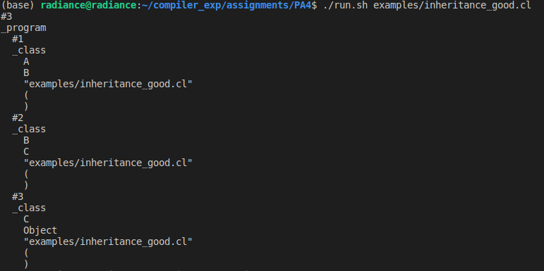

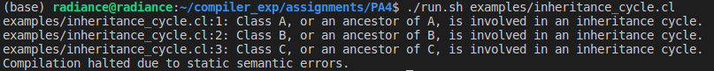
